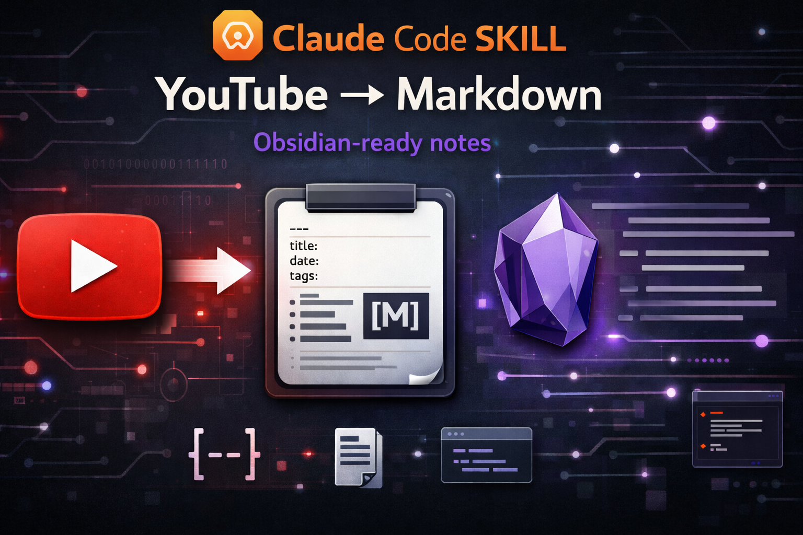

# YouTube Fetcher to Markdown

<p align="center">
  
</p>

Obsidian-ready YouTube archival notes with full metadata — a Claude Code skill that turns any YouTube video into a structured Markdown knowledge note.

```bash
npx skills add JimmySadek/youtube-fetcher-to-markdown
```

Most transcript tools dump raw text. This one captures the **complete context**: title, channel, description, chapters, duration, upload date, captions — organized as a proper knowledge base entry with YAML frontmatter you can query with [Dataview](https://github.com/blacksmithgu/obsidian-dataview).

## Why This Exists

There are dozens of transcript extractors. But if you're building a knowledge base (Obsidian, Logseq, or plain Markdown), you don't just want captions — you want a **complete archival note** that tells you:

- What video this came from and who made it
- When you captured it and from which project
- The creator's own description, links, and chapter breakdown
- The full transcript, cleanly formatted

This skill does all of that in one command, with no API keys.

## Output Example

```
~/yt_transcripts/2026-03-04_obsidian-the-king-of-learning-tools.md
```

```markdown
---
title: "Obsidian: The King of Learning Tools (FULL GUIDE + SETUP)"
channel: "Odysseas"
url: "https://www.youtube.com/watch?v=hSTy_BInQs8"
video_id: "hSTy_BInQs8"
fetched: "2026-03-04"
source_project: "my-project"
language: "en"
caption_type: "manual"
duration: "36m 26s"
upload_date: "2024-04-24"
tags:
  - yt-transcript
---

# Obsidian: The King of Learning Tools (FULL GUIDE + SETUP)

## Video Details
| Field    | Value |
|----------|-------|
| URL      | https://www.youtube.com/watch?v=hSTy_BInQs8 |
| Channel  | Odysseas |
| Duration | 36m 26s |
| Uploaded | 2024-04-24 |
| Fetched  | 2026-03-04 |
| Source   | my-project |
| Language | en (manual) |

## Video Description
Obsidian has been the centerpiece of my self-education...
[Full description with links and resources]

### Chapters
- `00:00` Intro
- `00:16` Avoiding Toxic Perfectionism
- `02:23` My Testimony
- ...

## Transcript
almost a year ago I started building this you can call it
a personal network of knowledge but you might know it as a...
```

## Features

- **Full metadata capture** — title, channel, duration, upload date, description, chapters via `yt-dlp`
- **Transcript extraction** — manual and auto-generated captions via `youtube-transcript-api`
- **Obsidian-ready** — YAML frontmatter with tags, queryable with Dataview
- **Duplicate detection** — warns if a video was already transcribed, shows the existing file
- **Source tracking** — records which project/directory triggered the fetch
- **Dependency check** — validates all prerequisites on startup, guides installation
- **Graceful fallback** — works without `yt-dlp` (loses description/chapters, keeps transcript)
- **Multiple formats** — Markdown (default), JSON, SRT
- **No API keys required** — works out of the box

## How It Works

```
YouTube URL
    │
    ├─→ yt-dlp ──→ title, channel, description, chapters, duration
    │
    └─→ youtube-transcript-api ──→ captions/subtitles
    │
    ▼
Structured Markdown with YAML frontmatter
    │
    ▼
~/yt_transcripts/YYYY-MM-DD_video-title-slug.md
```

1. **Extracts video ID** from any YouTube URL format
2. **Checks for duplicates** in `~/yt_transcripts/` by scanning frontmatter
3. **Fetches metadata** via `yt-dlp` (title, channel, description, duration, chapters)
4. **Fetches transcript** via `youtube-transcript-api` (prefers manual captions over auto-generated)
5. **Builds structured Markdown** with YAML frontmatter, metadata table, description, and transcript
6. **Saves to `~/yt_transcripts/`** with a date-prefixed, slugified filename

## Installation

### Quick Install (Recommended)

```bash
npx skills add JimmySadek/youtube-fetcher-to-markdown
```

Then install the Python dependencies:

```bash
pip install youtube-transcript-api requests
brew install yt-dlp  # macOS — or: pip install yt-dlp
```

### Manual Install

```bash
git clone https://github.com/JimmySadek/youtube-fetcher-to-markdown.git ~/.claude/skills/youtube-fetcher
pip install youtube-transcript-api requests
brew install yt-dlp  # macOS — or: pip install yt-dlp
```

### Verify Installation

The skill checks dependencies automatically on first run. You can also verify manually:

```bash
python3 ~/.claude/skills/youtube-fetcher/scripts/fetch_transcript.py --check-deps
```

## Usage

### Basic

```bash
python3 ~/.claude/skills/youtube-fetcher/scripts/fetch_transcript.py "https://youtu.be/VIDEO_ID"
```

Or just tell Claude Code:
> "Get me the transcript for https://youtu.be/VIDEO_ID"

### Options

| Flag | Description |
|------|-------------|
| `--timestamps` / `-t` | Include `[MM:SS]` timestamps in transcript |
| `--lang` / `-l` | Language code (default: `en`) |
| `--source` / `-s` | Override source project name |
| `--output` / `-o` | Custom output file path |
| `--format` / `-f` | Output format: `text` (default), `json`, `srt` |
| `--force` | Skip duplicate check |
| `--no-description` | Skip video description section |
| `--stdout` | Print to stdout instead of saving |
| `--list` | List available transcript languages |
| `--check-deps` | Check all dependencies |

### Examples

```bash
# Fetch with timestamps
python3 .../fetch_transcript.py "https://youtu.be/hSTy_BInQs8" --timestamps

# Fetch in Spanish
python3 .../fetch_transcript.py "https://youtu.be/hSTy_BInQs8" --lang es

# Export as SRT subtitle file
python3 .../fetch_transcript.py "https://youtu.be/hSTy_BInQs8" --format srt

# Force re-fetch of previously transcribed video
python3 .../fetch_transcript.py "https://youtu.be/hSTy_BInQs8" --force
```

## Exit Codes

| Code | Meaning |
|------|---------|
| `0` | Success |
| `1` | Runtime error (fetch failed, invalid URL) |
| `2` | Missing required dependencies |
| `3` | Duplicate skipped (user declined re-fetch) |

## Requirements

| Dependency | Required | Purpose |
|-----------|----------|---------|
| Python 3.8+ | Yes | Runtime |
| `youtube-transcript-api` | Yes | Transcript extraction |
| `requests` | Yes | oEmbed API fallback |
| `yt-dlp` | Recommended | Video description, chapters, duration |

## Limitations

- Only works on videos with captions (manual or auto-generated)
- Cannot transcribe videos with no captions at all (use [Whisper](https://github.com/openai/whisper) for that)
- Some videos have captions disabled by the uploader
- Private/age-restricted videos may not be accessible

## License

MIT
